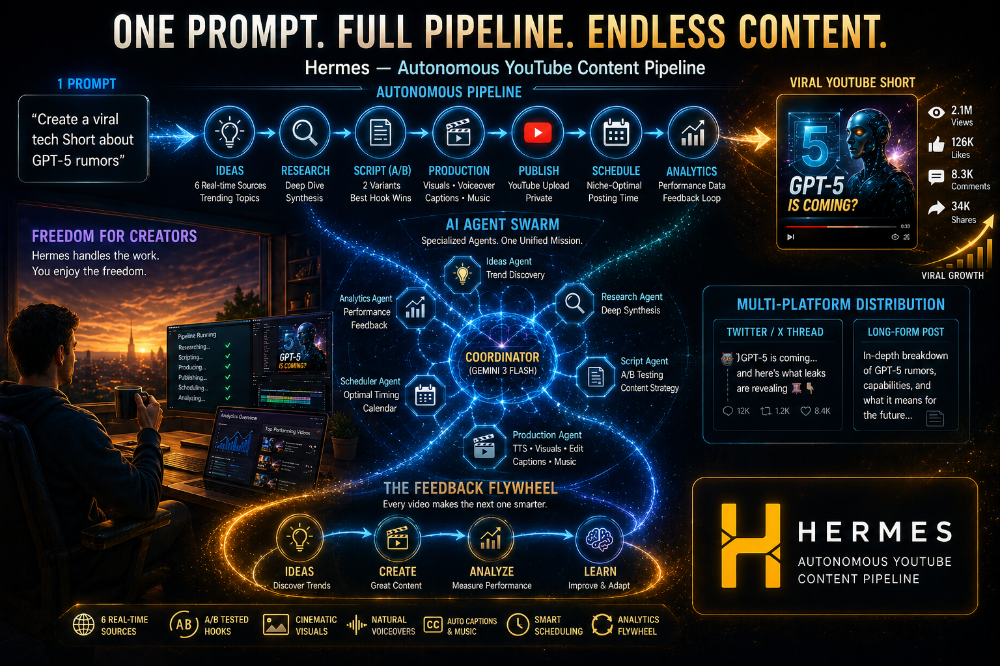
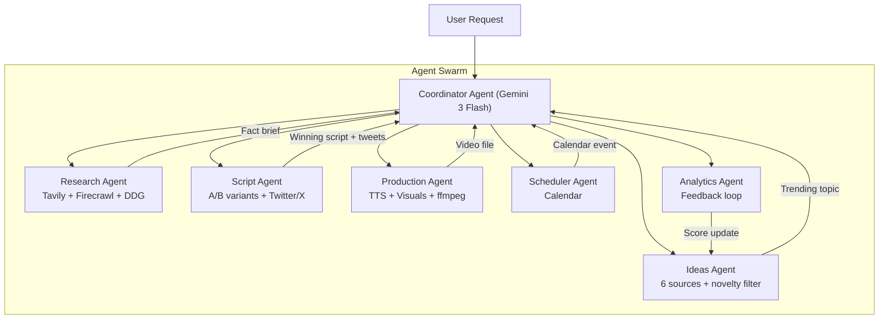
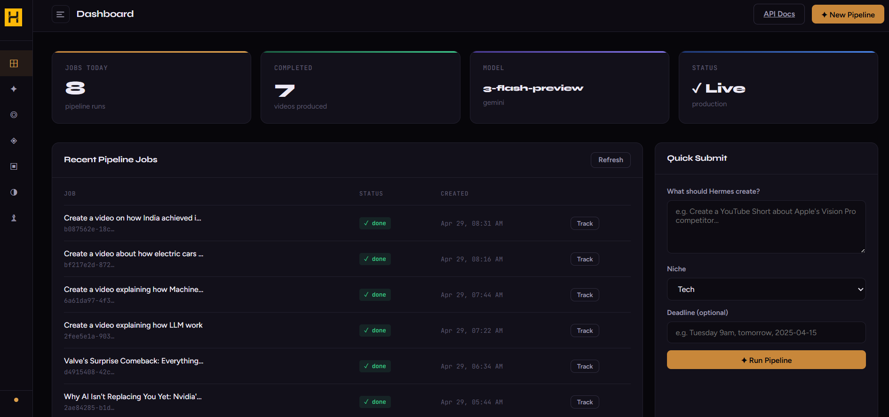
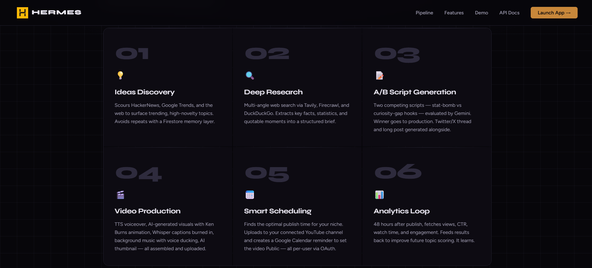
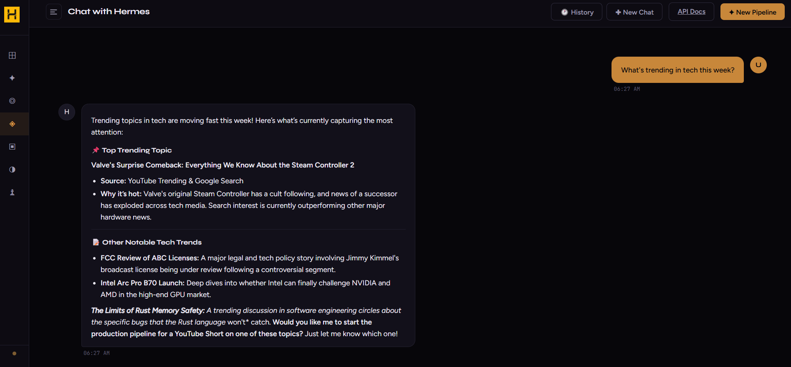
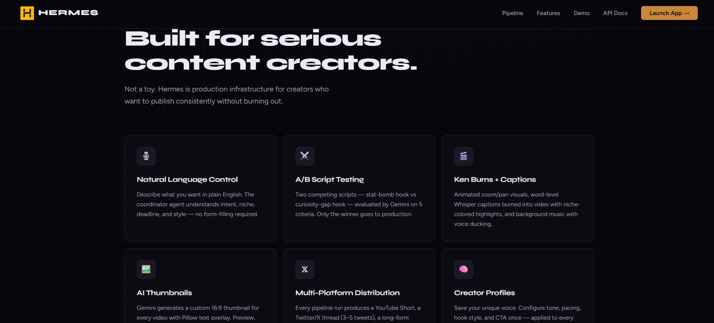

#  Hermes — Autonomous YouTube Content Pipeline

[](https://lablab.ai/)
[](https://content-pipeline-agents-mlk6ypldqq-uc.a.run.app)
[](https://www.python.org/)
[](https://deepmind.google/technologies/gemini/)

> **Autonomous Multi-Agent System** | Built for the **Gen AI Academy APAC Edition** hackathon.
>
> Hermes is a production-grade multi-agent content pipeline that transforms a simple natural-language directive into a fully researched, scripted, produced, and scheduled YouTube Short — complete with burned-in captions, Ken Burns visuals, background music, A/B-tested hooks, and multi-platform Twitter/X content.

<p align="center">
  
</p>

---

## 🌎 Project Resources

- **📺 Watch the Demo**: [https://youtu.be/oXP4rk82BzM](https://youtu.be/oXP4rk82BzM)
- **🚀 Interactive Dashboard**: [https://content-pipeline-agents-mlk6ypldqq-uc.a.run.app/app](https://content-pipeline-agents-mlk6ypldqq-uc.a.run.app/app)
- **🩺 API Health**: [https://content-pipeline-agents-mlk6ypldqq-uc.a.run.app/health](https://content-pipeline-agents-mlk6ypldqq-uc.a.run.app/health)

---

## ✨ What Hermes Does

One prompt. One pipeline. A complete YouTube Short — ready to publish.

| Stage | What happens |
|---|---|
| **Discover** | 6-source trend discovery: HackerNews, Google Trends, DuckDuckGo, Reddit, RSS feeds, YouTube Trending |
| **Research** | Multi-source web synthesis into a structured, fact-checked brief |
| **Script (A/B)** | Two competing scripts generated — stat-bomb hook vs curiosity-gap hook — Gemini picks the winner |
| **Produce** | ElevenLabs/Edge TTS voiceover → Flux.2/Imagen visuals → Ken Burns ffmpeg assembly → Whisper captions burned in → background music with voice ducking |
| **Publish** | YouTube private upload + Google Calendar reminder at niche-optimal posting time |
| **Distribute** | Twitter/X thread (3-5 tweets) + long-form post generated alongside the YouTube script |
| **Analyse** | 48h post-publish CTR/watch-time feedback loop updates topic scores for future runs |

---

## The Hermes Architecture

Hermes operates as a collaborative swarm of specialized agents, orchestrated by a central Coordinator. Each agent has specific tools and responsibilities, ensuring high-quality output at every stage of the lifecycle.



### Agent Roles & Responsibilities

| Agent | Capability | Core Tools |
|---|---|---|
| **Coordinator** | Orchestrates task decomposition, dispatching, and assembly across all 16 niches | Google ADK, LlmAgent |
| **Ideas Agent** | 6-source trend discovery with cross-reference scoring and novelty deduplication | HackerNews, Google Trends, DuckDuckGo, Reddit, RSS, YouTube Trending |
| **Research Agent** | Deep-dive synthesis into structured, fact-checked briefs | Tavily, Firecrawl, DuckDuckGo |
| **Script Agent** | A/B variant generation (stat-bomb vs curiosity-gap hooks), Gemini hook evaluation, Twitter/X thread + long post | Gemini 3 Flash, niche YAML profiles |
| **Production Agent** | TTS voiceover, Flux.2/Imagen visuals, Ken Burns ffmpeg assembly, Whisper captions, background music with voice ducking, thumbnail generation | ElevenLabs, Edge TTS, Modal Flux.2, ffmpeg, Whisper, Pillow |
| **Scheduler Agent** | Niche-optimal posting time selection, Google Calendar event creation | Google Calendar API |
| **Analytics Agent** | 48h post-publish metrics fetch, topic score updates, feedback flywheel | YouTube Analytics API, Firestore |

---

## Agent Interaction Flow

When a request like _"Create a viral tech Short about GPT-5 rumors"_ is received, Hermes executes the following sequence:

1. **Coordinator**: Parses intent, detects niche (`tech`), and dispatches tasks in sequence.
2. **Ideas Agent**: Casts a wide net across 6 sources, cross-references results, filters against Firestore to avoid repeating topics, and saves the winning topic with source attribution.
3. **Research Agent**: Executes recursive web searches via Tavily/Firecrawl/DuckDuckGo and synthesizes results into a structured brief.
4. **Script Agent**: Loads the niche YAML profile, generates Variant A (stat-bomb) and Variant B (curiosity-gap), calls `evaluate_hook_ab`, saves the winner, then generates a Twitter/X thread + long post + hashtags.
5. **Production Agent**: TTS → Flux.2/Imagen visuals → Whisper captions → Ken Burns ffmpeg assembly → background music with voice ducking → thumbnail → YouTube upload using the user's connected channel credentials.
6. **Scheduler Agent**: Reads niche-optimal posting windows, maps the deadline to the best slot, and creates a Google Calendar reminder for the user to manually set the video to Public at the scheduled time in YouTube Studio.
7. **Analytics Agent** (triggered 48h post-publish): Fetches CTR, watch time, impressions, likes, and comments; updates analytics and adjusts niche topic performance scores in Firestore.

Throughout this flow, the dashboard receives **SSE events** in real-time — each stage transition pushes instantly to the UI without polling.

---

## 🧠 Niche Intelligence

Hermes ships with **16 YAML niche profiles** that shape the entire pipeline end-to-end:

`beauty` · `business` · `cooking` · `crypto` · `education` · `finance` · `fitness` · `gaming` · `general` · `history` · `mindset` · `news` · `science` · `sports` · `tech` · `travel`

Each profile controls: script tone, pacing, hook style, word count target, visual style, color palette, caption highlight color, music mood, TTS voice, topic discovery queries, and optimal posting windows.

---

## 🔐 Authentication & Multi-User

Hermes uses **Firebase Authentication** for user identity and full data isolation — every job, token, and piece of content is scoped to the authenticated user.

### Sign-in methods
- **Email / Password** — standard signup and login
- **Google Sign-In** — one-click via Google Identity Services (GSI) popup; creates or links a Firebase account automatically

### How it works
- Firebase Admin SDK (v7.4.0) verifies ID tokens server-side on every protected request
- Tokens are stored in `localStorage` and auto-refreshed before expiry using the Firebase secure token endpoint
- All API endpoints require `Authorization: Bearer <id_token>` — the SSE stream endpoint accepts the token as a query param since `EventSource` doesn't support custom headers

### Per-user YouTube channel connection
Each user connects their own YouTube channel through a dedicated OAuth 2.0 flow:

1. User clicks **Connect YouTube** in the sidebar
2. A Google OAuth consent popup opens requesting `youtube.upload` scope
3. On approval, the authorization code is exchanged for tokens server-side
4. The refresh token is stored in Firestore under `user_youtube_tokens/{uid}`
5. All subsequent uploads use that user's credentials — not a shared global token

The production agent resolves credentials in order: per-user token → global `.env` fallback. If neither is present, the upload step returns a clear error with instructions.

> **Note on YouTube API verification**: Unverified GCP projects (created after July 28, 2020) will have uploaded videos forced to private mode until Google audits the project. The upload itself works — videos just stay private until you pass the compliance audit. Default quota is 10,000 units/day (~6 uploads).

### Per-user Google Calendar connection
Each user can connect their Google Calendar for automated scheduling:

1. User clicks **Connect Calendar** in the sidebar
2. A Google OAuth consent popup opens requesting calendar event scopes
3. On approval, tokens are stored in Firestore under `user_calendar_tokens/{uid}`
4. The Scheduler Agent creates calendar events on the user's own calendar for upcoming publishes

---

## 🎬 Production Quality

### A/B Script Testing
The Script Agent generates two competing scripts from the same research brief:
- **Variant A** — "Stat Bomb" hook: opens with the single most shocking number
- **Variant B** — "Curiosity Gap" hook: opens with a provocative question

Gemini evaluates both on 5 criteria (hook power, retention, niche fit, CTA strength, shareability) and the winner goes to production.

### Video Assembly
- **Ken Burns effects** — animated zoom/pan per scene image
- **Whisper captions** — word-level timestamps, ASS format with niche-colored word-by-word highlight, burned into video; SRT also generated for YouTube upload
- **Background music** — niche mood-matched tracks with automatic voice ducking
- **Thumbnail** — Gemini-generated 16:9 thumbnail with Pillow text overlay

### Multi-Platform Output
Every pipeline run produces:
1. YouTube Short (video file + metadata + private upload to user's channel; set to Public manually at the scheduled time)
2. Twitter/X thread (3-5 tweets, each ≤280 chars)
3. Twitter/X long post (500-1000 chars)
4. Relevant hashtags

---

## 🖥 Dashboard

The Hermes Dashboard (`/app`) provides real-time pipeline visibility with full auth:

- **Login / Signup screen** — email+password or Google Sign-In, shown before the app shell
- **SSE live updates** — `EventSource` replaces polling; stage transitions push instantly
- **Job Tracker** — loads all jobs from the database on open (not just in-memory), scoped to the authenticated user
- **Pipeline tab** — animated step-by-step progress (Ideas → Research → Script → Production → Scheduling)
- **Script tab** — full coordinator output with copy button
- **𝕏 Twitter tab** — thread cards with per-tweet character counter and copy buttons
- **Analytics tab** — per-video metrics (views, CTR, watch time, likes, comments, impressions)
- **Chat** — persistent chat sessions with the coordinator agent (history saved in Firestore)
- **Quick Submit** — niche chip selector + deadline field → one-click pipeline launch
- **Creator Profiles** — save and manage custom creator profiles (tone, pacing, hook style, CTA)
- **Connect YouTube** pill in sidebar — shows channel name when connected, click to disconnect
- **Connect Calendar** pill in sidebar — link Google Calendar for automated scheduling events
- **Retry Upload** — re-attempt YouTube upload for videos that assembled successfully but failed to upload
- **Thumbnail Preview** — view and download generated thumbnails for completed jobs

---

## API Reference

### Public Endpoints

| Method | Endpoint | Description |
|---|---|---|
| `GET` | `/` | Landing page |
| `GET` | `/app` | Hermes Dashboard UI |
| `GET` | `/health` | Service health + config flags |
| `GET` | `/niches` | List all available content niches |

### Auth Endpoints (public)

| Method | Endpoint | Description |
|---|---|---|
| `POST` | `/auth/signup` | Create account with email + password |
| `POST` | `/auth/login` | Sign in with email + password |
| `POST` | `/auth/google` | Sign in with Google ID token or access token (from GSI) |
| `POST` | `/auth/refresh` | Exchange refresh token for new ID token |
| `GET` | `/auth/google/popup` | Redirect to Google OAuth consent screen (popup flow) |
| `GET` | `/auth/google/callback` | Google OAuth callback — exchanges code, returns auth via postMessage |

### Auth Endpoints (authenticated)

| Method | Endpoint | Description |
|---|---|---|
| `GET` | `/auth/me` | Current user info + YouTube & Calendar connection status |

### YouTube OAuth Endpoints (authenticated)

| Method | Endpoint | Description |
|---|---|---|
| `GET` | `/auth/youtube` | Get Google OAuth URL to connect YouTube channel |
| `GET` | `/auth/youtube/callback` | OAuth callback — exchanges code, stores tokens |
| `GET` | `/auth/youtube/status` | Check if user has connected YouTube |
| `POST` | `/auth/youtube/disconnect` | Remove stored YouTube tokens |

### Calendar OAuth Endpoints (authenticated)

| Method | Endpoint | Description |
|---|---|---|
| `GET` | `/auth/calendar` | Get Google OAuth URL to connect Google Calendar |
| `GET` | `/auth/calendar/callback` | OAuth callback — exchanges code, stores calendar tokens |
| `GET` | `/auth/calendar/status` | Check if user has connected Google Calendar |
| `POST` | `/auth/calendar/disconnect` | Remove stored Calendar tokens |

### Pipeline Endpoints (authenticated)

| Method | Endpoint | Description |
|---|---|---|
| `POST` | `/pipeline` | Submit a pipeline job (returns `job_id` immediately) |
| `GET` | `/jobs` | List all jobs for the authenticated user, newest first |
| `GET` | `/pipeline/{job_id}` | Poll job status and full data (owner only) |
| `GET` | `/pipeline/{job_id}/stream` | SSE stream — real-time stage events (auth via `?token=`) |
| `GET` | `/pipeline/{job_id}/script` | Retrieve the generated script, hook, CTA, and YouTube metadata |
| `GET` | `/pipeline/{job_id}/twitter` | Retrieve Twitter/X content for a completed job |
| `GET` | `/pipeline/{job_id}/download` | Generate a 60-min signed GCS URL to download the final MP4 |
| `GET` | `/pipeline/{job_id}/download-thumbnail` | Generate a 60-min signed GCS URL to download the thumbnail |
| `GET` | `/pipeline/{job_id}/thumbnail` | Short-lived signed URL (5 min) for displaying thumbnail in `` |
| `POST` | `/pipeline/{job_id}/analytics` | Trigger analytics agent for a video |

### Chat Endpoints (authenticated)

| Method | Endpoint | Description |
|---|---|---|
| `POST` | `/chat` | Send a message to the coordinator agent (maintains session state) |
| `GET` | `/chat/sessions` | List the user's past chat sessions, newest first |
| `GET` | `/chat/sessions/{session_id}/messages` | Load all messages for a chat session |
| `DELETE` | `/chat/sessions/{session_id}` | Delete a chat session and all its messages |

### Creator Profile Endpoints (authenticated)

| Method | Endpoint | Description |
|---|---|---|
| `GET` | `/creator-profiles` | List all creator profiles for the authenticated user |
| `GET` | `/creator-profiles/{creator_id}` | Get a single creator profile |
| `POST` | `/creator-profiles` | Create or update a creator profile (tone, pacing, hook style, CTA) |
| `DELETE` | `/creator-profiles/{creator_id}` | Delete a creator profile |

### Video Endpoints (authenticated)

| Method | Endpoint | Description |
|---|---|---|
| `GET` | `/videos/{video_job_id}` | Get current status of a video job (upload status, YouTube URL, etc.) |
| `POST` | `/videos/{video_job_id}/retry-upload` | Retry YouTube upload + scheduling for an already-assembled video |

### Analytics Endpoints (authenticated)

| Method | Endpoint | Description |
|---|---|---|
| `GET` | `/analytics` | List analytics for the user's videos with metrics (views, CTR, watch time) |
| `GET` | `/analytics/{video_id}` | Get detailed analytics for a specific video |

---

## Project Structure

```
content-pipeline-agents/
├── app.py                    # FastAPI entry point + ADK Runner + SSE + auth endpoints
├── requirements.txt          # Pinned dependencies (Python 3.11+)
├── .env.example              # Configuration template
│
├── agents/
│   ├── coordinator/          # Root orchestrator — 16-niche aware
│   ├── ideas/                # 6-source trend discovery
│   ├── research/             # Fact synthesis (Tavily + Firecrawl + DDG)
│   ├── script/               # A/B script variants + Twitter/X generation
│   ├── production/           # TTS + Flux.2/Imagen + Ken Burns ffmpeg + Whisper + music
│   ├── scheduler/            # Niche-optimal scheduling + Calendar
│   └── analytics/            # Performance feedback loop
│
├── niches/                   # 16 YAML niche profiles
│
├── shared/
│   ├── auth.py               # Firebase Auth — signup, login, Google SSO, token verify
│   ├── youtube_oauth.py      # Per-user YouTube OAuth 2.0 flow + token storage
│   ├── calendar_oauth.py     # Per-user Google Calendar OAuth 2.0 flow + token storage
│   ├── models.py             # Pydantic models (Topic, Script, VideoJob, TwitterContent, …)
│   ├── niches.py             # YAML loader + convenience accessors
│   ├── database.py           # Firestore client with in-memory fallback
│   ├── config.py             # Settings (Gemini / OpenAI-compatible / Firebase / YouTube)
│   ├── storage.py            # GCS helpers — upload, download, signed URLs, delete
│   ├── captions.py           # Whisper ASS/SRT generation
│   ├── media.py              # ffmpeg Ken Burns assembly + music ducking
│   └── thumbnail.py          # Gemini + Pillow thumbnail generation
│
├── static/
│   ├── app.html              # Hermes Dashboard (auth screen + SSE + tabbed detail panel)
│   └── index.html            # Landing page
│
├── music/                    # Bundled royalty-free background tracks
├── demo/                     # Sample requests, test scripts
└── scripts/                  # OAuth helpers (YouTube / Calendar)
```

---

## Tech Stack

| Layer | Technology |
|---|---|
| **LLM (agents)** | **Kimi-K2.5** via Nebius OpenAI-compatible endpoint (configurable) |
| **LLM (evaluation)** | **Gemini 3 Flash** (`gemini-3-flash-preview`) via Vertex AI |
| **Agent Framework** | **Google ADK 1.31+** |
| **Authentication** | **Firebase Auth** (email/password + Google SSO) via firebase-admin 7.4.0 |
| **Image Generation** | **Flux.2** via Modal or Google Imagen |
| **TTS** | **ElevenLabs** (primary) → **Edge TTS** (fallback) |
| **Captions** | **OpenAI Whisper** (word-level timestamps → ASS/SRT) |
| **Video Assembly** | **ffmpeg-python** (Ken Burns, caption burn-in, music ducking) |
| **Research** | Tavily, Firecrawl, DuckDuckGo |
| **Topic Discovery** | HackerNews API, Google Trends, DuckDuckGo, Reddit, RSS, YouTube Trending |
| **Infrastructure** | Google Cloud Run + Cloud Firestore + Google Cloud Storage |
| **API Framework** | FastAPI + uvicorn (SSE via `StreamingResponse`) |

---

## Setup & Deployment

### Prerequisites

- Python 3.11+
- `ffmpeg` installed and on PATH
- Google Cloud CLI (`gcloud`) authenticated: `gcloud auth application-default login`
- A `.env` file (copy from `.env.example`)

### Local Quickstart

```bash
# 1. Create and activate virtual environment
python -m venv .venv
.venv\Scripts\activate        # Windows
# source .venv/bin/activate   # macOS/Linux

# 2. Install dependencies
pip install -r requirements.txt --use-deprecated=legacy-resolver

# 3. Configure environment
cp .env.example .env
# Edit .env — minimum required keys listed below

# 4. Run
python app.py
```

Open the **Hermes Dashboard** at `http://localhost:8080/app`.

### Key Environment Variables

| Variable | Purpose |
|---|---|
| `LLM_PROVIDER` | `gemini` or `openai_compatible` |
| `OPENAI_API_BASE` | Base URL for OpenAI-compatible endpoint (e.g. Nebius) |
| `OPENAI_API_KEY` | API key for the above |
| `OPENAI_MODEL` | Model name (e.g. `moonshotai/Kimi-K2.5`) |
| `GOOGLE_API_KEY` | Google AI Studio key (Gemini A/B evaluation + Vertex AI) |
| `GOOGLE_CLOUD_PROJECT` | GCP project ID (Firestore + Cloud Run) |
| `FIREBASE_API_KEY` | Firebase Web API key — from GCP Console → API Keys (auto-created by Firebase) |
| `IMAGE_PROVIDER` | `flux2` (Modal) or `imagen` (Google) |
| `MODAL_FLUX2_ENDPOINT_URL` | Modal Flux.2 endpoint |
| `ELEVENLABS_API_KEY` | ElevenLabs TTS (optional — falls back to Edge TTS) |
| `YOUTUBE_CLIENT_ID` | OAuth 2.0 client ID for YouTube uploads |
| `YOUTUBE_CLIENT_SECRET` | OAuth 2.0 client secret |
| `CALENDAR_CLIENT_ID` | OAuth 2.0 client ID for Google Calendar (falls back to YouTube client) |
| `CALENDAR_CLIENT_SECRET` | OAuth 2.0 client secret for Calendar (falls back to YouTube client) |
| `DEMO_MODE` | `false` for full production pipeline, `true` to skip heavy media steps |

### Firebase Auth Setup

1. Go to [Firebase Console](https://console.firebase.google.com) → your project
2. Enable **Authentication** → **Sign-in method** → enable **Email/Password** and **Google**
3. Copy the **Web API Key** from Project Settings → General → set as `FIREBASE_API_KEY`
4. For local dev, ensure `gcloud auth application-default login` is run so Firebase Admin SDK can authenticate

### YouTube OAuth Setup (per-user uploads)

1. Go to [Google Cloud Console](https://console.cloud.google.com/apis/credentials) → your project
2. Enable **YouTube Data API v3**
3. Configure the **OAuth consent screen** (External) — add `youtube.upload` scope
4. Create (or reuse) an **OAuth 2.0 Client ID** (Web application type)
5. Add authorized redirect URI: `http://localhost:8080/auth/youtube/callback`
6. Set `YOUTUBE_CLIENT_ID` and `YOUTUBE_CLIENT_SECRET` in `.env`
7. Each user connects their own channel via the **Connect YouTube** button in the dashboard sidebar

### Calendar OAuth Setup (per-user scheduling)

1. Go to [Google Cloud Console](https://console.cloud.google.com/apis/credentials) → your project
2. Enable **Google Calendar API**
3. Reuse the same OAuth 2.0 Client ID from YouTube setup (or create a separate one)
4. Add authorized redirect URI: `http://localhost:8080/auth/calendar/callback`
5. Set `CALENDAR_CLIENT_ID` and `CALENDAR_CLIENT_SECRET` in `.env` (falls back to YouTube OAuth credentials if not set)
6. Each user connects their calendar via the **Connect Calendar** button in the dashboard sidebar

### Cloud Run Deployment

```bash
chmod +x deploy.sh && ./deploy.sh
```

---

## The Feedback Flywheel

Analytics data actively improves future content:

1. **Analytics Agent** fetches CTR, watch time, and impressions 48h post-publish
2. Updates `/analytics/{video_id}` and adjusts the niche performance score in Firestore
3. **Ideas Agent** queries topics ordered by these scores — proven formats get priority
4. **6-source cross-referencing** — topics appearing in 2+ sources get a signal bonus

---

## 📸 Screenshots

<table>
  <tr>
    <td align="center">
      <br/>
      <sub><b>Landing Page</b></sub>
    </td>
    <td align="center">
      <br/>
      <sub><b>Dashboard</b></sub>
    </td>
  </tr>
  <tr>
    <td align="center">
      <br/>
      <sub><b>New Video Pipeline</b></sub>
    </td>
    <td align="center">
      <br/>
      <sub><b>Pipeline Progress</b></sub>
    </td>
  </tr>
  <tr>
    <td align="center">
      <br/>
      <sub><b>Job Tracker</b></sub>
    </td>
    <td align="center">
      <br/>
      <sub><b>Chat with Coordinator</b></sub>
    </td>
  </tr>
  <tr>
    <td align="center">
      <br/>
      <sub><b>Creator Profiles</b></sub>
    </td>
    <td align="center">
      <br/>
      <sub><b>Capabilities</b></sub>
    </td>
  </tr>
  <tr>
    <td align="center">
      <br/>
      <sub><b>Tech Stack</b></sub>
    </td>
    <td align="center">
      <br/>
      <sub><b>Live Demo</b></sub>
    </td>
  </tr>
  <tr>
    <td align="center" colspan="2">
      <br/>
      <sub><b>Video Library</b></sub>
    </td>
  </tr>
</table>

---

## 🗺 Roadmap

- [ ] **Background Music via ElevenLabs** — AI-generated, niche-matched background music using ElevenLabs music generation for richer audio production
- [ ] **Long-Form Video Generation** — Extend the pipeline beyond YouTube Shorts to produce full-length videos (5–20 min) with multi-scene structure, chapter markers, and extended narration
- [ ] **Multi-Platform Publishing** — TikTok and Instagram Reels export
- [ ] **Microservice Migration** — Decouple agents into independent Cloud Run instances

---

## 📄 License

Released under the **MIT License**. Created with ❤️ for the **Gen AI Academy APAC Edition**.
