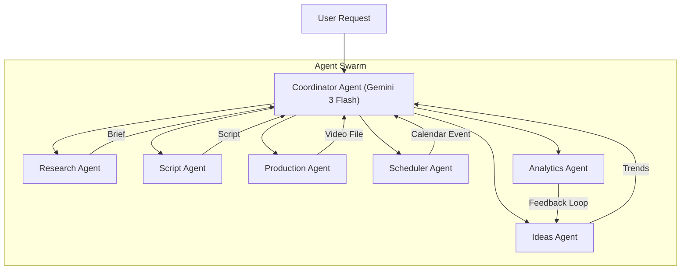

# Hermes — Autonomous YouTube Content Pipeline

> **Autonomous Multi-Agent System** | Gemini 3 Flash · Google ADK · Cloud Run · Firestore

Hermes is a production-grade multi-agent content pipeline that transforms simple natural-language directives — like _"Create a YouTube Short about the psychological impact of social media"_ — into a fully researched, scripted, produced, and scheduled video, entirely without human intervention.

---

## The Hermes Architecture

Hermes operates as a collaborative swarm of specialized agents, orchestrated by a central Coordinator. Each agent has specific tools and responsibilities, ensuring high-quality output at every stage of the lifecycle.



### Agent Roles & Responsibilities

| Agent | Capability | Core Tools | Cloud Run Type |
|---|---|---|---|
| **Coordinator** | The Brain. Orchestrates task decomposition, dispatching, and assembly. | Google ADK, LlmAgent | Service |
| **Ideas Agent** | Discovers trending topics and prioritizes them based on historical performance. | Google Trends, HackerNews API | Service |
| **Research Agent** | Conducts deep-dives into topics to generate structured, factual briefs. | Tavily, Firecrawl, DuckDuckGo | Service |
| **Script Agent** | Drafts platform-optimized scripts in the creator's specific voice and tone. | Gemini 3, Style-matching logic | Service |
| **Production Agent** | Handles media generation: Voiceovers, Imagen visuals, and ffmpeg assembly. | Edge TTS, ElevenLabs, Imagen 3 | Job (Async) |
| **Scheduler Agent** | Determines optimal posting times and creates Google Calendar entries. | Google Calendar API, YouTube API | Service |
| **Analytics Agent** | Tracks post-publish performance and feeds metrics back into the Ideas DB. | YouTube Analytics API, Firestore | Job (Cron) |

---

## Project Structure

```bash
content-pipeline-agents/
├── app.py                    # FastAPI entry point + ADK Runner
├── deploy.sh                 # Cloud Run deployment script
├── .env.example              # Key configuration templates
│
├── agents/                   # Individual Agent logic & Toolsets
│   ├── coordinator/          # Root orchestrator
│   ├── ideas/                # Trending discovery
│   ├── research/             # Fact synthesis
│   ├── script/               # Creative writing
│   ├── production/           # Media generation (TTS/Imagen/ffmpeg)
│   ├── scheduler/            # Calendar & YouTube scheduling
│   └── analytics/            # Performance feedback loops
│
├── static/                   # Hermes Dashboard (app.html / index.html)
├── shared/                   # Shared Pydantic models & Firestore Config
└── scripts/                  # Auth utilities (YouTube/Calendar)
```

---

## Agent Interaction Flow

When a request like _"Create an AI trends video"_ is received, Hermes executes the following technical sequence:

1.  **Coordinator**: Parses intent, niche, and deadline. Dispatches tasks.
2.  **Ideas Agent**: 
    - Fetches trending topics via HackerNews/Google Trends.
    - Filters against `/topics` in Firestore to avoid repetition.
3.  **Research Agent**: 
    - Executes recursive web searches via Tavily/Firecrawl.
    - Synthesizes search results into a structured Markdown brief.
4.  **Script Agent**: 
    - Loads the creator's specific tone/pacing from `/creator_profiles`.
    - Generates a script with visual scene cues.
5.  **Production Agent** (Background Job):
    - **TTS**: Generates voiceover file.
    - **Imagen**: Generates 3-5 cinematic scenes based on script cues.
    - **ffmpeg**: Bonds audio, visuals, and dynamic captions into a 9:16 video.
    - **Upload**: Pushes to YouTube as "Private" for creator review.
6.  **Scheduler Agent**: 
    - Maps the deadline to the optimal posting window.
    - Creates a Google Calendar entry with the project link.
    - Sets the YouTube "Scheduled Publish" timestamp.

---

## The Feedback Flywheel

Analytics data is not just stored — it is actively used to improve the system:
1. **Analytics Agent** fetches metrics (CTR, Watch Time) 48h post-publish.
2. Updates `/analytics/{video_id}` and adjusts the niche performance score in Firestore.
3. **Ideas Agent** queries topics ordered by these scores.
4. Future content cycles prioritize proven formats, ensuring channel growth through data-driven discovery.

---

## Tech Stack

| Layer | Technology |
|---|---|
| **Model** | **Gemini 3 Flash** (`gemini-3-flash-preview`) |
| **Framework** | **Google ADK** (Agent Development Kit) |
| **Infrastructure** | Google Cloud Run (Services + Jobs) |
| **Database** | Cloud Firestore + Google Cloud Storage |
| **Media** | Edge TTS / ElevenLabs + Gemini Imagen |
| **Research** | Tavily, Firecrawl, DuckDuckGo |

---

## Setup & Deployment

### Local Quickstart

1. **Install Dependencies**:
   ```bash
   pip install -r requirements.txt
   ```
2. **Environment**:
   ```bash
   cp .env.example .env
   # Add your GOOGLE_API_KEY and YouTube/Calendar Refresh Tokens
   ```
3. **Run**:
   ```bash
   python app.py
   ```
   Access the **Hermes Dashboard** at `http://localhost:8080/app`.

### Deployment to Cloud Run

**Automated Deployment**:
```bash
chmod +x deploy.sh
./deploy.sh --project YOUR_PROJECT_ID
```

**Manual Deployment Steps**:
1. **Build**: `gcloud builds submit --tag gcr.io/PROJECT_ID/hermes`
2. **Deploy Service**: `gcloud run deploy hermes --image gcr.io/PROJECT_ID/hermes --memory 2Gi --timeout 3600 --allow-unauthenticated`
3. **Deploy Analytics Job**: `gcloud run jobs create analytics-agent --image gcr.io/PROJECT_ID/hermes --command python --args "agents/analytics/run_job.py"`

---

## Scaling to Microservices

Each agent is designed as a standalone module. To convert to true microservices:
1. Assign a unique `Dockerfile` to each agent folder.
2. Update the **Coordinator Agent** `AgentTool` definitions to use HTTP endpoints instead of direct function calls.
3. The monorepo structure allows this transition in ~5 minutes per agent.
